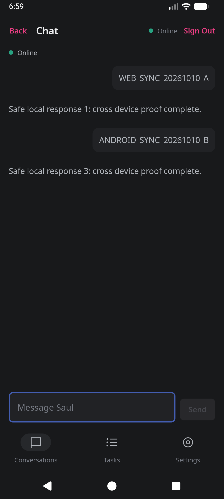
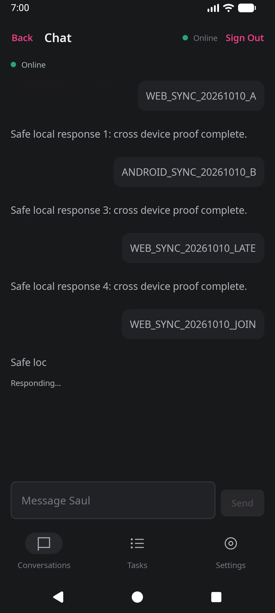
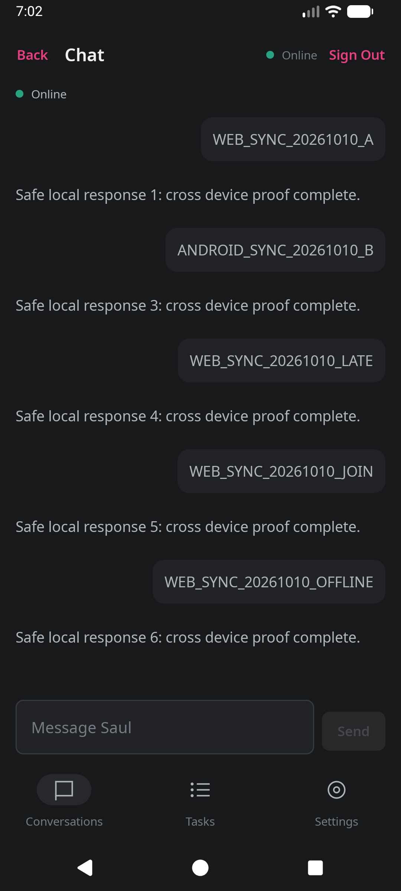

# Multi-device chat sync: verification report and implementation plan

Date: 2026-10-10.

Status: online sync was verified on the local stack. The hardening work below is proposed, not implemented. This report does not certify the deployed service.

## 1. Conclusion

One user's web and native Android clients can already read and send messages in the same Saul conversation. No rewrite of the agent or transport is needed for the tested cases.

Keep the server as the source of truth. Keep full conversation snapshots over Server-Sent Events (SSE), a connection through which the server sends updates. Make submission identity, connection lifetime, and restart behavior reliable before adding automatic retries or offline sending.

This scope is **one user on several devices**. It does not include shared rooms for different users. Each device can select its own conversation. Selecting a chat on the web must not force Android to switch chats.

## 2. What was verified

The test used the real web UI, native Android UI, Better Auth sign-in and device authorization, Express controllers, ChatService, and installed Pi Durable 1.0.0. Both clients used one disposable account and conversation #2. Web used localhost:3000; Android used 10.0.2.2:3000, which reached the same test server.

Only model inference was simulated. Pi's faux provider returned numbered text responses at eight tokens per second. It made no tool calls. No paid inference, real email, or personal database was used.

| Case | Observed result |
| --- | --- |
| Send from web | Android displayed `WEB_SYNC_20261010_A` and response 1. |
| Send from Android | An already-open web chat displayed `ANDROID_SYNC_20261010_B` and response 3. |
| Stream then complete | A partial assistant response became one completed response. |
| Android joins during generation | Android displayed `WEB_SYNC_20261010_JOIN`, partial text `Safe loc`, then the completed response 5. |
| Android loses its network connection | Existing history remained. After reconnect, the missed web message and response 6 appeared once. |
| Different conversation | Conversation #12 contained none of the five tagged messages from #2. |
| Anonymous stream request | Rejected with HTTP 401. |
| Authenticated request for an unowned ID | Rejected with HTTP 403. |

### Independent state evidence

The final snapshot for conversation #2 contained five user entries and five assistant entries. All eleven entry IDs were unique; the other entry was a system entry. The conversation was settled, with an empty live-state document and inbox.

| Sent message | User entry ID | Assistant entry ID |
| --- | --- | --- |
| `WEB_SYNC_20261010_A` | 7 | 11 |
| `ANDROID_SYNC_20261010_B` | 22 | 25 |
| `WEB_SYNC_20261010_LATE` | 26 | 29 |
| `WEB_SYNC_20261010_JOIN` | 30 | 33 |
| `WEB_SYNC_20261010_OFFLINE` | 34 | 37 |

The reconnect recording contained twelve full snapshots. Eight included live generation state. The identity record showed two sessions for the same disposable user.

### Inspected screenshots

#### Both message directions, completed

The Android transcript contains the web message and response 1, then the native message and response 3. Android-to-web receipt is also recorded in the web DOM and independent SSE data.



#### Join during a response



#### Reconnect and catch up



Screenshots support the observations; they do not prove identity or delivery on their own. Android's header does not display the conversation ID. Recorded navigation, API data, and account mappings establish that association.

### Build and test conditions

- The web production build completed and was served by the test application.
- Android `assembleDebug testDebugUnitTest` completed, but all 44 Gradle tasks were up to date. Existing reports contained 24 tests with zero failures. Those unit tests were not freshly executed in this run.
- The debug APK ran on `Medium_Phone_API_36.1` in read-only mode without saving emulator changes.
- The backend used Node 25.7.0 and the current `setupDurableHarness` and `createApp`. It did not execute the production `src/server.ts` bootstrap. Environment loading and provider selection were bypassed to isolate data and avoid paid requests.
- Disposable schema setup needed `user.role` and `deviceCode` fields that the checked-in SQL migrations did not supply. This workaround is test setup, not a production migration fix.

### Limits and discarded evidence

No sync failure was reproduced in the matrix above. This does not prove absence of failures outside that matrix.

Not tested: real inference, tool/thinking projection parity, simultaneous same-text sends, an HTTP response lost after acceptance, automatic retries, server restart/resume, release HTTPS, proxy idle timeouts, or Android process-death recovery. A same-account conversation control is not a second-user isolation test.

An initial launcher capture, a capture of the wrong conversation, and a Send tap during a keyboard transition were not used as delivery proof. One web screenshot was overwritten by a later reconnect case; Android-to-web proof uses the captured DOM and SSE record instead. Conversation #12 contained an unplanned `hy` exchange of uncertain origin; it was used only to check that tagged #2 messages did not leak into #12.

The disposable backend was stopped and its databases were removed. The emulator and verification browsers were closed. No implementation files were changed by verification. No commit, deployment, or production migration was made.

Detailed local logs and snapshot recordings remain under `.amp/in/artifacts/sync-*`. That directory is ignored by Git. The retained screenshots and decisive results above make this report reviewable without those local files.

## 3. Existing design

```text
Web or Android
  ├─ POST /api/chat: submit a command to conversation C1
  └─ GET /api/stream?conversationId=C1: observe saved state
                         │
                         ▼
              Saul authenticates the user
              and checks conversation access
                         │
                         ▼
              Pi admits input and runs tasks
              Committed view changes are published
                         │
                 ┌───────┴───────┐
                 ▼               ▼
              Web view       Android view
```

The server sends an `init` event with the current view, then `update` events with full views. Both clients rebuild their transcript from each view. They do not copy messages to each other. A reconnect starts with a fresh current view; it does not replay every missed SSE event.

### How the tested sync worked

1. Web and Android signed in through separate sessions for the same user. The server allowed both sessions to access conversation #2.
2. Both clients observed #2 through `/api/stream?conversationId=2`. Each connection received its own initial full view. A device attaching after a message was saved could read that message in its initial view.
3. The web sent `WEB_SYNC_20261010_A` through `POST /api/chat` with conversation ID #2. ChatService submitted the input to that Pi conversation. Pi saved user entry 7 and started generation.
4. Pi committed changes to the conversation view as the response progressed. The server's view subscription sent updated snapshots to clients connected at that time. Android did not have to send a request for the answer or run its own agent.
5. The web and Android projections rebuilt the visible messages from their initial and updated snapshots. The completed answer was saved as assistant entry 11 and appeared on both clients. The separate late-join case verified attachment while generation was still active.
6. Android sent `ANDROID_SYNC_20261010_B` through the same POST endpoint with the same conversation ID. Pi saved user entry 22 and assistant entry 25. The web, already subscribed, received and displayed them without a page reload.

The HTTP reply to the sending device was not the cross-device delivery mechanism. The SSE subscriptions delivered the shared state. Thus Android could observe a web send, and web could observe an Android send, without forwarding one device's HTTP response to the other.

```text
Web sends to conversation #2
       │
       ▼
Pi saves entry 7, streams the answer, then saves entry 11
       │
       ├─ updated view → web projection → web transcript
       └─ updated view → Android projection → Android transcript

Android sends to conversation #2
       │
       ▼
Pi saves entry 22, streams the answer, then saves entry 25
       │
       ├─ updated view → web projection → web transcript
       └─ updated view → Android projection → Android transcript
```

### Why these cases worked

- **Same destination:** both devices reached the same backend and explicitly selected the same conversation ID. Separate device sessions did not create separate transcripts for this test.
- **One saved history:** Pi owned the conversation state. Each client read that state instead of maintaining a competing server-side history.
- **Live subscriptions:** a saved view change triggered an update on each active stream, not only on the device that sent the message.
- **Initial state on attachment:** a late Android connection received the work already in progress. It did not need the earlier stream events to reconstruct the visible state.
- **Snapshot replacement:** both clients rebuilt history rather than appending the entire snapshot. This prevented snapshot-driven duplication in the tested cases. It does not prove duplicate sends are prevented.

During the network interruption, Android could not receive live updates. It retained its last visible history. Web continued sending and receiving against the server. When Android regained network access, its repository retried the stream connection. The fresh initial view contained the missed message and completed response, so Android caught up. This proves catch-up after reconnect, not continuous delivery while disconnected or sending while offline.

### When sync was absent, and how to diagnose a failure

No unexpected sync failure was reproduced. Two tested cases correctly had no shared updates: a disconnected Android client could not receive live data, and a client viewing conversation #12 did not receive #2's tagged messages. Both are expected boundaries, not defects.

For a reported failure, check these boundaries in order. The untested entries below are diagnostic hypotheses, not established causes of an incident.

| Symptom | Boundary to check | Evidence in this report |
| --- | --- | --- |
| A device sees a different history | Compare backend address, signed-in user, and selected conversation ID. | Both devices matched for the passing test; #12 correctly stayed separate. |
| Android stops receiving while disconnected | Check connectivity and stream retry state. | Observed network interruption; delivery resumed after reconnect. |
| An authorized device cannot open the stream | Inspect authentication and ownership response before debugging rendering. | Anonymous requests returned 401; unowned requests returned 403. Valid test sessions succeeded. |
| A send appears locally but not on the other device | Check whether the server admitted the input and saved a user entry. A local optimistic bubble is not proof of admission. | Tagged test sends have durable entry IDs. Failed or ambiguous admission was not forced. |
| The server has the message, but the other UI does not | Check that UI's SSE connection, received view, and projection. | Both projections rendered tested text states. Tool/thinking parity and release proxy behavior remain untested. |
| Messages appear twice after retry | Check request-ID reuse and pending-message reconciliation. | No duplicates in the ordinary run. Lost HTTP responses and retry duplication remain untested risks. |
| Saved work does not progress after a server restart | Check scheduler enablement and registered dependencies. | Current startup omits explicit resume; restart recovery was not tested. |
| A fresh server cannot reach sign-in or chat | Check schema initialization and migrations. | The isolated fixture needed missing schema fields. This was a setup blocker, not a reproduced failure of live sync. |

First determine whether the command reached Pi, whether the view reached the device, and whether the UI rendered that view. Fix the failing boundary. Do not replace the sync architecture because a device opened a different chat or because authentication rejected its request.

Current owners of this behavior:

| Responsibility | File |
| --- | --- |
| HTTP submit, access check, SSE stream | [src/controllers/chat.ts](../src/controllers/chat.ts) |
| Conversation creation and Pi submission | [src/services/chat.ts](../src/services/chat.ts) |
| Pi startup and registry | [src/setup/durable.ts](../src/setup/durable.ts) |
| User-to-conversation mapping | [src/db/schema.ts](../src/db/schema.ts), [src/agent/data.ts](../src/agent/data.ts) |
| Web stream and pending messages | [use-chat-session.ts](../web/src/features/chat/use-chat-session.ts) |
| Web view projection | [chat-view.ts](../web/src/features/chat/chat-view.ts) |
| Native stream, reconnect, and sending | [ChatRepository.kt](../android/app/src/main/java/io/github/gajendrasinghdawar/lali/data/chat/ChatRepository.kt) |
| Native view projection | [ChatProjection.kt](../android/app/src/main/java/io/github/gajendrasinghdawar/lali/data/chat/ChatProjection.kt) |
| Android lifecycle connection | [ChatScreen.kt](../android/app/src/main/java/io/github/gajendrasinghdawar/lali/feature/chat/ChatScreen.kt) |

The local Pi checkout is version 1.1.0, while this verification used Saul's installed 1.0.0. Use the installed API as the implementation contract. The source example `test/examples/21-late-join.ts` demonstrates the same initial-state-plus-updates pattern; `19-json.ts` demonstrates raw change operations. Neither example alone proves Saul sync.

## 4. Rules the implementation must preserve

1. One server owns the Pi storage. Do not run competing harness processes against the same file. Multiple devices are clients, not storage owners.
2. Authenticate and check access before reading, subscribing, submitting, or retrieving a submission receipt. Cookie clients retain CSRF protection. Bearer authentication must be validated, not inferred from a header prefix.
3. Use an explicit conversation ID for sending and observing. Never assume that conversation ID `1` is a user's main chat.
4. Apply a full snapshot by replacement, not by appending its messages. Canonical message identity comes from saved entry IDs, not message text.
5. Treat a connection failure as “connection lost,” not “server did not accept the message.”
6. Use one request ID per intentional send. Reuse that ID and the unchanged payload for retries. A new intentional send gets a new ID, even when its text is identical.
7. Stop old subscriptions on navigation, sign-out, and lifecycle stop. An old conversation must not update a newly selected conversation.
8. Keep connection status, message acceptance, and agent completion separate. “Accepted” does not mean “answered.”
9. Reconnect restores the current conversation. It does not promise background notifications or offline submission.

## 5. Risks found by code inspection

These are code-level risks, not failures reproduced by the cross-device run.

| Risk | Why it matters |
| --- | --- |
| Request IDs do not reach Pi | A timeout followed by a new send can create a second submission. The web's local ID is not included in its POST; Android also omits a server request ID. |
| Pending messages are matched by text | Web can match an old identical message. Android checks for a new entry ID, but another device's new identical message can still match. |
| POST waits for model settlement | A long response can outlast an HTTP request. The caller cannot reliably distinguish acceptance from rejection. |
| Web callbacks are not scoped to a connection generation | A late stream or HTTP callback can affect a different selected conversation. Reproduce this before changing the behavior. |
| Main chat is an unordered first mapping | Concurrent first requests can select/create different conversations. The app database and Pi database do not share an atomic transaction. |
| Conversation lists refresh differently | A new chat or rename on one device is not guaranteed to appear promptly on the other. The server also filters a global scan capped at 100 conversations. |
| SSE disposal has gaps | The server unsubscribes on close but does not dispose the acquired view; close handling is registered after asynchronous acquisition. Check early disconnect and repeated reconnect resource use. |
| Startup does not call `harness.resume()` | Idle saved work may not continue until another submit/wait enables scheduling. Resume must start only after dependencies are ready. |
| Authentication schema and migrations differ | A fresh deployment cannot be considered verified using the disposable fixture workaround. |

## 6. Proceed in small, verifiable stages

Implement these stages in order. Keep changes local until reviewed. Each stage must have an observable pass condition. Do not combine a transport rewrite with delivery fixes.

### Stage 1: make the current proof repeatable

Use an isolated local account, app database, Pi database, and safe scripted model. Do not load personal environment files. Retain a small repeatable harness and journey procedure only where they test user-visible contracts. Record which APK, web bundle, and server source were exercised.

First reconcile the missing schema migrations and test a fresh database from checked-in migrations. Do not edit production tables as part of this stage. Exercise validated cookie and bearer identities, including invalid bearer headers combined with cookies. The current CSRF wrapper checks only the header prefix; do not assume that establishes a valid bearer identity.

**Gate:** both send directions, late join, reconnect, separate-conversation control, and second-user denial pass without manual schema repair. Unit tests support this gate but do not replace real UI journeys.

### Stage 2: identify and acknowledge each send

Extend the existing `/api/chat` contract with a client-generated request ID. Validate the input, check ownership, and pass the ID through ChatService to `conversation.submit()`. Use Pi's existing durable submission records; do not create a second message queue or a separate deduplication database.

Return an acceptance receipt promptly after durable admission, rather than waiting for the answer. The receipt should identify the conversation, request, and Pi submission, with its current status and entry ID when available. Add an authorized way to query that receipt by conversation and request ID after an uncertain HTTP result. Completion still arrives through the stream.

Pi 1.0.0 deduplicates request IDs within a conversation. For an existing ID it returns the original submission; it does not compare input text. Define the gateway contract accordingly: a retry refers to the original command, and clients must not alter its payload. If payload-conflict rejection becomes required, design and test it explicitly; do not claim Pi already provides it.

Reconcile optimistic messages with the receipt and canonical entry ID. If a receipt is lost, query or resubmit the same request ID. Do not hide a pending message because unrelated text matches. An accepted queued input needs a visible accepted/queued state until it appears in the transcript.

**Gate:** deliberately drop the HTTP response after admission, retry the same request ID, and observe one submission, one user entry, and one run. Repeat after server restart. Send identical text from two devices with different IDs and observe two separate commands. Test both orderings: stream before receipt, and receipt before stream. No automatic retry ships before this gate passes.

### Stage 3: make connection lifetime explicit

Keep full snapshots and the existing SSE endpoint. Treat the snapshot transcript as canonical and pending commands as a separate local overlay.

On web conversation changes, cancel pending HTTP work where possible, close the old stream, reset conversation-specific run state, and ignore callbacks belonging to the old connection. Cancellation of a client request must not be presented as cancellation of already accepted server work.

Keep Android's lifecycle-bound connection and bounded reconnect delay. Check malformed events, terminal authentication failures, app background/foreground, and process recreation. Retain the last valid snapshot for the same conversation while reconnecting; never display it as the new conversation's history.

On the server, handle disconnects during view acquisition, unsubscribe and dispose the view, and clean up timers. Add SSE heartbeat comments only with a tested interval appropriate to the real proxy. Handle slow clients without an unbounded response buffer; disconnect and resnapshot rather than silently losing correctness.

**Gate:** switch A → B while A is streaming and verify no A content or busy state appears in B. Repeat reconnects and verify subscriptions return to baseline. Invalid events do not erase valid history. Reconnect replaces history without duplicate messages. Cookie/bearer expiry stops access and clears user-specific state.

### Stage 4: make conversation discovery reliable

Return and use explicit IDs across both clients. Define a stable main-conversation association instead of selecting an unordered first row. Serialize concurrent local creation and persist a unique per-user main association. Account for a crash between creating the Pi conversation and saving its app mapping; do not imply the two databases commit together. Never delete all mappings because one mapping is stale.

Make listing complete for the user's conversations rather than filtering only the first global 100. Refresh the list on screen entry, foreground/reconnect, and local create/rename/delete. Add a user-level list update channel only if prompt live list changes are a requirement; do not introduce it just to sync an open transcript.

**Gate:** two devices make their first request concurrently and resolve the same main ID. Chats still list correctly with more than 100 global conversations. Creating or renaming on one device appears on the other at the documented refresh boundary. Restoring/deleting a chat cannot expose another user's data. Each device retains its independent selection.

### Stage 5: prove restart and release behavior

Enable `harness.resume()` once task definitions, model access, credentials, and other required services are ready. Confirm the startup order using the normal bootstrap, not only a custom test entry point. Test safe and unsafe interrupted tools according to Pi's recovery policy; do not promise that every external action executes exactly once.

Repeat the decisive journeys using a release Android build, HTTPS, and the deployed proxy configuration in an authorized test environment. Confirm idle-stream behavior, reconnect, sign-out/revocation, and server restart while a response is active. An interrupted model request may restart; require consistent saved history, not identical token timing or wording.

Use sanitized request/conversation IDs, status codes, connection counts, and reconnect timing for diagnosis. Do not log session tokens, private prompts, or tool output by default.

**Gate:** restart recovery begins without a new user message. Both devices eventually show the same settled canonical transcript. Release connections survive or recover from proxy/network interruption. Access is denied after revocation. Schema setup works from migrations. Record proof before claiming release readiness; do not trigger a deployment without authorization.

## 7. Tests to keep and proof to rerun

Extend existing tests first. Keep tests for observable contracts, not private callback order.

| Boundary | Required regression case |
| --- | --- |
| Gateway + real Pi storage | Same request ID retried after lost acknowledgement/restart yields the original submission. Different IDs with identical text remain distinct. |
| Gateway access | Second user cannot submit, stream, or query receipts for another user's conversation. Validate cookie/bearer and CSRF combinations. |
| Web and Android projections | Equivalent fixtures for completed history, live text, thinking, tool results, empty and malformed states; live-to-final does not duplicate. |
| Client delivery state | Receipt/snapshot orderings, same-text messages, failed/unknown acceptance, sign-out and conversation switch. |
| Stream lifecycle | Early close, repeated reconnect, slow client, terminal authorization error; no retained subscriptions. |
| Conversation discovery | Concurrent main creation, stale single mapping, paginated user lists. |

Relevant existing tests include `web/test/chat-view.test.ts` and Android's `ChatSendTest`, `ChatStreamTest`, `ChatActivityTest`, `ConversationsTest`, and `GatewayJourneyTest`. Equivalent projection fixtures are preferable to a new data transfer object (DTO) layer initially. A DTO is the public data shape sent to clients. Introduce one only when a concrete Pi-version or platform mismatch requires it.

For each stage, rerun real web-to-Android and Android-to-web journeys with distinct tags. Capture a partial and final state, an independent canonical transcript, and the denied control. Force the timing boundary under test. A screenshot or mocked repository alone is not cross-device proof.

## 8. Defer these features

- Offline send queues and automatic replay until durable request identity is proven.
- Background mobile delivery and push notifications; foreground SSE does not provide either.
- Multiple people in one conversation; that needs membership and permissions beyond owner checks.
- CRDTs, device-to-device replication, and a WebSocket replacement. They are not required for this server-owned transcript.
- Raw operation streaming until full-snapshot size or bandwidth is measured to be a problem.
- A second canonical transcript database or multiple processes sharing one Pi storage.

Start with Stage 1, then implement Stage 2 as the first delivery-behavior change. The target is not a new sync engine. It is a proven contract around the engine Saul already uses.
